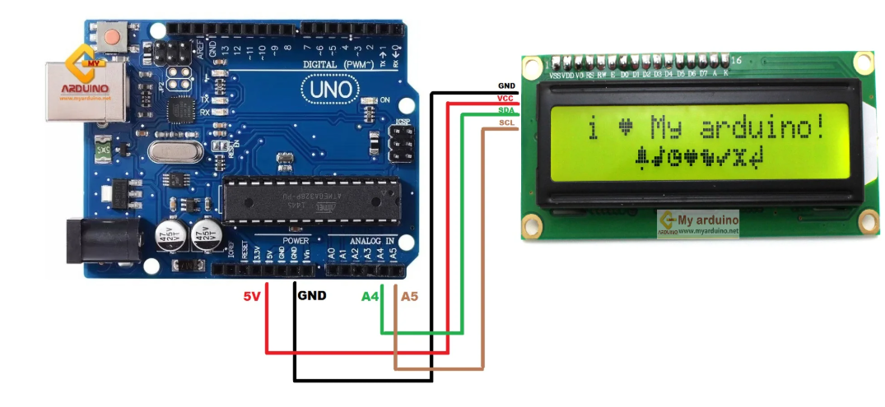

# python's pysyrial, C++'s libserial

In this project, I want to study how to use pyserial python and C++ to do serial communication between computer/raspberry pi with linux ubuntu OS, to arduino using serial communication.

I would like to see the blocking characteristic of read() function, and how to avoid or mitigate it.
- use timeout, check 2_bidirectional.cpp
- need to sleep for 2 seconds after Serial.open() to wait for serail port to be really ready to use. Otherwise, could find some strange behavior in 2_direction.py/cpp like
data sent (to not-ready serial), and no data received back (because the data were sent to a not-ready serial).

I would like to know how to log the message sent to arduino, since serial port is already used, the normal arudino's serial monitor cannot be used.
- The answer is to use arduino LCD to log.

## Arduino LCD connection [1]




## Sending message from Arduino to Computer through serial port 0_from_arduino_to_rasspberrypi

open file pyserial_study/chapter1/arduino/0_from_arduino_to_rasspberrypi/0_from_arduino_to_rasspberrypi.ino with Arduino IDE, and upload it to arduino

Computer Terminal python

```
cd pyserial_study/chapter1/python
python3 0_arduino_to_raspberrypi.py
```
expected result

```
Serial Ok
Hello from Arduino

Hello from Arduino

```
The line should be printed 1 second per sentence (1Hz)

or Computer Terminal C++

```
cd pyserial_study/chapter1/cpp
mkdir build; cd build
cmake ..
make
./0_arduino_to_raspberrypi 
```

expected result

```
RETRUN FROM ARDUINO:Hello from Arduino
RETRUN FROM ARDUINO:Hello from Arduino
```
The line should be printed 1 second per sentence (1Hz)

## Sending message from computer to arduino through serial port 

Open pyserial_study/chapter1/arduino/from_raspberrypi_to_arduino_i2c_lcd/from_raspberrypi_to_arduino_i2c_lcd.ino with Arduino IDE, and upload it to arduino

Computer Terminal python

```
cd pyserial_study/chapter1/python
python3 1_raspberrypi_to_arduino.py 
```
expected result

Look at LCD, there should be the message "Hello from Raspberry pi" once a second (1Hz)

or Computer Terminal C++

```
cd pyserial_study/chapter1/cpp/build
./1_raspberrypi_to_arduino
```

expected result

Look at LCD, there should be the message "rasp cpp string" once a second (1Hz)

## Bidirectional

Open pyserial_study/chapter1/arduino/bidrectional_i2c_lcd/bidrectional_i2c_lcd.ino with Arduino IDE, and upload it to arduino.

Computer Terminal python

```
cd pyserial_study/chapter1/python
python3 2_bidectional.py 
```

expected result on computer terminal 

```
0
0
0
15
response from arduino:Hello from Raspberry pi 2
```
with 1 Hz. 

expected result on LCD 

There should be the message "Hello from Raspberry pi" once a second (1Hz).

or Computer Terminal C++

```
cd pyserial_study/chapter1/cpp/build
./2_bidirectional
```

expected result on computer terminal 

```
0WRITING TO ARDUINO:rasp cpp string
0WRITING TO ARDUINO:rasp cpp string
0WRITING TO ARDUINO:rasp cpp string
0WRITING TO ARDUINO:rasp cpp string
0WRITING TO ARDUINO:rasp cpp string
BEFORE READLINE
RETRUN FROM ARDUINO:rasp cpp string 13
BEFORE READLINE
RETRUN FROM ARDUINO:rasp cpp string 14
BEFORE READLINE
RETRUN FROM ARDUINO:rasp cpp string 15
```
printed in 1Hz.

expected reuslt on LCD

rasp cpp string 1rasp cpp string 2rasp cpp string 3...


Reference 
[1] Arduino LCD connection https://www.cybertice.com/article/97/%E0%B8%AA%E0%B8%AD%E0%B8%99%E0%B9%83%E0%B8%8A%E0%B9%89%E0%B8%87%E0%B8%B2%E0%B8%99-arduino-%E0%B9%81%E0%B8%AA%E0%B8%94%E0%B8%87%E0%B8%82%E0%B9%89%E0%B8%AD%E0%B8%84%E0%B8%A7%E0%B8%B2%E0%B8%A1-%E0%B9%81%E0%B8%A5%E0%B8%B0-%E0%B8%84%E0%B9%88%E0%B8%B2-sensor-%E0%B8%95%E0%B9%88%E0%B8%B2%E0%B8%87%E0%B9%86%E0%B8%AD%E0%B8%AD%E0%B8%81%E0%B8%88%E0%B8%AD-lcd-1602-%E0%B9%81%E0%B8%9A%E0%B8%9A-i2c?gad_source=1&gad_campaignid=22641276948&gbraid=0AAAAADc4pmPRvE9ZnQmg0qh1jr_oupyhZ&gclid=CjwKCAjwprjDBhBTEiwA1m1d0sf2DyOFnsLwZtBGayLqBSjEFbSWTy4_Tc8xkQZhGJXv-oU0GDXucRoCZVAQAvD_BwE


 
